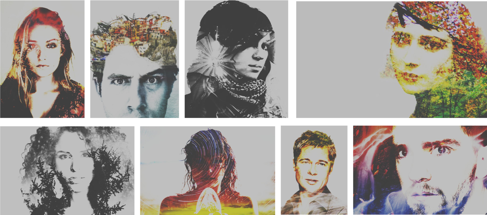
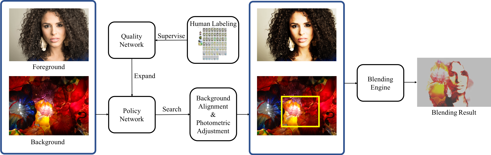

# Learning To Blend Photos, ECCV 2018

## Code/Data will be released soon 

This repo demonstrate the following paper:

[Learning to Blend Photos](http://openaccess.thecvf.com/content_ECCV_2018/html/Wei-Chih_Hung_Learning_to_Blend_ECCV_2018_paper.html) <br/>
[Wei-Chih Hung](https://hfslyc.github.io/), [Jianming Zhang](https://jimmie33.github.io/), [Xiaohui Shen](http://users.eecs.northwestern.edu/~xsh835/), [Zhe Lin](https://research.adobe.com/person/zhe-lin/), [Joon-Young Lee](https://joonyoung-cv.github.io/), and [Ming-Hsuan Yang](http://faculty.ucmerced.edu/mhyang/) <br/>
Proceedings of the European Conference on Computer Vision (ECCV), 2018.

Contact: Wei-Chih Hung (whung8 at ucmerced dot edu)

# Introduction

In this work, we aim to automate the photo blending process through deep reinforcement learning. We focus on a specific and popular photo blending style - Double Exposure. The image below shows some example results of our method:



The figure below shows the overview of our system. The inputs of our method are two photos: foreground and background. We first train a quality network to evaluate the aesthetics quality of blending photos with human preference annotation on random blending photos. Then a deep reinforcement learning based agent is trained to optimize the parameter for the background alignment and photometric adjustment. Using the predicted parameters, the blending engine renders the final blending photo. 




Please cite our paper if you find it useful for your research.
```
@inproceedings{Hung_blend_2018,
  author = {Wei-Chih Hung and Jianming Zhang and Xiaohui Shen and Zhe Lin and Joon-Young Lee and Ming-Hsuan Yang},
  booktitle = {European Conference on Computer Vision},
  title = {Learning to Blend Photos},
  year = {2018}
}
```
